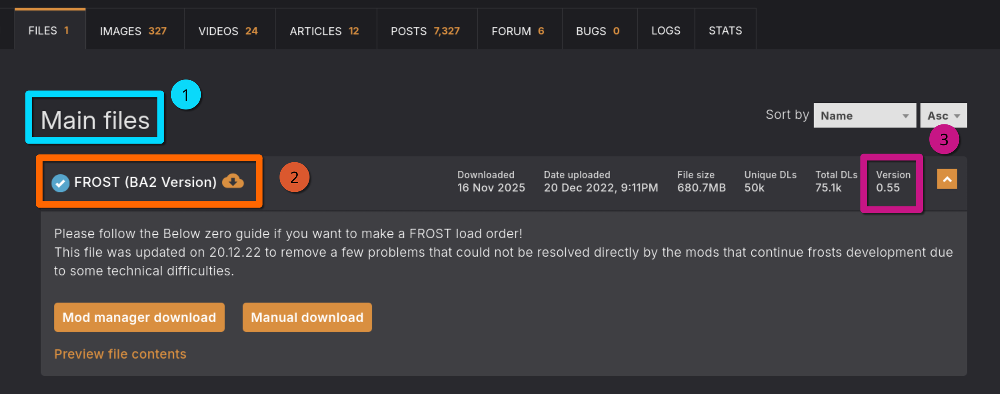

# Installing Mod Organizer 2 (MO2)
<small>
:material-information-box:
This section tells you how to properly install and setup Mod Organizer 2 (MO2).
</small>

!!! danger "Read this first!"

    In this step, we will install and configure Mod Organizer 2, the best mod manager for any Bethesda game.
    You can alternatively use Vortex, but this guide does not provide details and information on how to use Vortex.
    If you use Vortex, you still need to read and follow the ==Game Settings== and the ==Mod Installation Instructions== part of this section.

    **Never use two mod managers for the same game at once. This will mess things up badly.**

---
## What is Mod Organizer 2?
Mod Organizer 2 (MO2) is an open source game mod manager, mainly used for Bethesda games. It allows for save mod installation and uninstallation while leaving the game's folder untouched and clean. MO2 does not install mods directly into the game's folder, but rather creates a virtual filesystem that the game reads from. This allows for:

* Safe mod installation and uninstallation,
* Being able to modify mod install order at any point,
* Having multiple profiles/instances with different mod setups,
* Keeping original game files clean.

Additionally, MO2 has a "portable" mode that allows you to move the entire MO2 folder to another location or PC with minimal setup. 
MO2 has built-in support for Nexus Mods, allowing you to download mods directly from the Nexus. 

Mod Organizer 2 has been chosen for our guide due to its ease of use and its ability to keep the game's folder clean. This is important because it allows for easy conflict resolution and mod management, and makes correcting mistakes trivial - installed mods in the wrong order? Just drag them into the correct position!

Compared to Vortex, MO2 doesn't hide the most important parts of modding from the user, making it easier to understand what is happening and why, albeit at the cost of potentially looking scary at first.

That said, we are well aware that MO2 is not perfect, and it has its own set of issues and limitations, but it is the best tool for the job. 

---
## Installing Mod Organizer 2
1. Download the ==Mod Organizer 2== file from [here](https://www.nexusmods.com/skyrimspecialedition/mods/6194?tab=files)
2. Once the download has finished, run the installer
3. When prompted to choose an installation location, pick any location 
    * **outside** of any default Window folders (like `Program Files x86`{: .path}) **and**
    * **outside** of the game's **Root** folder
4. Click **Next** until the installer finishes


---
## Configuring Mod Organizer 2

### Initial Setup

1. Run **ModOrganizer.exe**
2. You will be prompted with a pop-up called **Creating an instance**, in which you should select ==Create a portable instance==
3. On the next page, select **Fallout 4**
4. On the next page, keep the **Location** file path default
5. On the last page, select **Finish**
6. MO2 will launch and prompt you with a pop-up called **Show tutorial?**, in which you should select **No**
7. From the pop-up called **Register?**, select **Yes**
  - This pop-up will not show up if you have already registered a different instance of MO2
8. If you see a pop-up called ==INI file is read-only==, select **Remember my choice** from the drop-down at the bottom then click **Clear the read-only flag**.

### Configuring Settings
1. Select the  mo2 settings button at the top of MO2 to open the settings
2. In the **Theme** tab, you can select a different style from the drop-down menu at the top
    - I use the **vs15 Dark theme**
3. In the **Nexus tab**, select **Connect to Nexus**
    * This option will not show up if you have already connected your Nexus account on a different MO2 instance

  


4. MO2 will open your browser and prompt you to ==authorize== the connection
5. Once you authorize it, you can close out of your browser and of the MO2 settings
6. Allow MO2 to ==restart== if it asks

---
## Creating Profiles
Mod Organizer 2's **Profiles feature** allows for easy switching between different mod configurations. This is especially useful because you can easily switch between a FROST Profile and a non-FROST profile if you have the desire to play FROST and normal Fallout 4. In this step, we will create a profile for the guide while keeping a strictly-vanilla profile for testing/debugging. Profiles can be selected via the drop-down menu above the left pane. 


1. Select the  mo2 profiles button at the top of MO2 to open the profile's menu
2. Select the **Default profile**, then select **Copy**
3. Name the new profile **FROST**
Select the **FROST** profile and make sure **Use profile-specific Game INI Files** is checked at the bottom

You may get a pop-up called **INI file is read-only** when attempting to make/select a new profile. If so then select **Remember my choice** from the drop-down at the bottom then click **Clear the read-only flag**


5. Exit out of the profiles menu and select the **FROST** profile from the drop-down above the left panel


---
## Game Settings
In this step, we will download and run Bethini Pie, which will allow choosing optimized presets and more specific options all through an easy to use interface. If you have trouble following these instructions, this [**tutorial video :fontawesome-brands-youtube:**](https://www.youtube.com/watch?v=vNv2_x0fVhA) might help you out.

=== "MO2"
    1. Download [Bethini Pie](https://www.nexusmods.com/site/mods/631).
    2. Extract the archive anywhere outside of the default Windows folders, such as `C:\Modding Tools`.
    * In MO2, click on the ==drop-down== in the right pane next to the **Run** button.
    * Click **<Edit...\>**, then click the **+** symbol in the top left and ==Add from file==.
    * In the resulting explorer window, navigate to where you installed Bethini Pie and select ==Bethini.exe==.
    * Press ==Apply== in the lower right, then **OK**.
    * Select **Bethini** from the drop-down and ==run== it.
    * Click **Fallout 4** then press ==Select Game==.
    * If you get a **Setup** prompt press ==OK==. You don't need to redirect the INI path to MO2's profile folder because MO2's VFS already handles the redirection.
    * Apply the following settings:
        1. Select a the ==High== Bethini ==preset==, unless you have a Potato PC
        2. Apply ==Recommended Tweaks==.
        3. Set **Display Mode** to ==Borderless Windowed==.
        4. Select the ==resolution== you want to display the game in.
        5. Make sure **Text Language** is set to ==English== both in Bethini Pie and on Steam (other languages are not supported by the guide).
        6. Edit the other settings to your liking.
        7. Click **File** then ==Save== in the top left, then confirm the prompts and close Bethini.

=== "Vortex"
    1. Download [Bethini Pie](https://www.nexusmods.com/site/mods/631).
    2. Extract the archive anywhere outside of the default Windows folders, such as `C:\Modding Tools`.
    * Navigate to where you installed Bethini Pie and run ==Bethini.exe==.
    * Click **Fallout 4** then press ==Select Game==
        * You might have to provide the game's installation path
    * If you get a **Setup** prompt press ==OK==. You don't need to redirect the INI path to MO2's profile folder because MO2's VFS already handles the redirection.
    * Apply the following settings:
        1. Select a the ==High== Bethini ==preset==, unless you have a Potato PC
        2. Apply ==Recommended Tweaks==.
        3. Set **Display Mode** to ==Borderless Windowed==.
        4. Select the ==resolution== you want to display the game in.
        5. Make sure **Text Language** is set to ==English== both in Bethini Pie and on Steam (other languages are not supported by the guide).
        6. Edit the other settings to your liking.
        7. Click **File** then ==Save== in the top left, then confirm the prompts and close Bethini.


<!-- 
This is a very important step!
1. Make sure the **FROST** profile is active
2. Click the  at the top of MO2 and select **INI Editor**
3. Select the **Fallout4Custom.ini** tab
4. Paste in the following to **enable lose files**:
```
[Archive]
bInvalidateOlderFiles=1
sResourceDataDirsFinal=
``` 
5. Save your changes

These settings allow for files from mods to be loaded in-game. It is intentional that the bottom setting does not have anything after the =


**If you did everything correctly, it should look similar to the picture.**
Keep in mind that your .ini file might look different or even empty, that is normal.
Just make sure that the settings you've added (the ones in the red box in the picture) are present.


---
## INI Tweaks
In this step, we will configure the game's INI files to increase performance/stability at minimal visual cost. 

1. Make sure the **FROST** profile is active
2. Click the  at the top of MO2 and select **INI Editor**
3. Select the **Fallout4Prefs.ini** tab
4. Use ++ctrl+f++ to find and change the following options
    * Set ``fDirShadowDistance`` to 7000
    * Set ``fShadowDistance`` to 7000
    * Set ``uiOrthoShadowFilter`` to 2
    * Set ``iMaxFocusShadowsDialogue`` to 3
    * Set ``iMaxFocusShadows`` to 3
    * Set ``fBlendSplitDirShadow`` to 96.0000
5. Save your changes
6. Close the INI editor

These settings tweak shadows to drastically improve performance without much visual cost. 

!!! info "Note"
    You can also add ``bEnableWetnessMaterials=0`` (or change it if it already exists) in your **Fallout4Prefs.ini** in MO2. This will deactivate the wetness effect from objects when it's raining. This causes snow to not be "wet" anymore. Only do this if you really want it or are bothered that snow sometimes has a slight wetness/reflection effect when it's raining.
-->

---
## Enabling steamloader

=== "Steam"

    Steam users don't need to follow this step, only GOG users.

=== "GOG"

    In MO2 you need to enable add a flag to F4SE so that MO2 can properly start Fallout 4.
    Vortex users do not need to do this step.

    1. Open the **drop-down menu** for the executables in MO2, and select **Edit**
    
    2. Add `-forcesteamloader` in the **Arguments** section of the **F4SE** executable
    


!!! info "How to MO2"
    If you need some information and help on how to use MO2, you might want to read the [MO2 Sorting Crashcourse](https://github.com/sower-j/modding-guides/blob/main/mo2-sorting-crashcourse.md)

---
## Mod Installation Instructions

### How to use Nexus to download mods

When the guide says to install a mod, it will be formatted as follows: 

==Main File(s) - FROST (BA2 Version) 0.55==

This is referring to the mod's ==files category== on Nexus, the ==file name==, and the ==file version==. Sometimes I will leave the file version out, in that case just download the newest version.



!!! warning ""
    Unless instructed otherwise, simply download the listed file using the ==Mod Manager Download== button and install it through MO2.

### Installing mods with MO2
==Standard procedure== through the manager:

1. Download the indicated file(s).
2. Open the **Downloads** tab in MO2 (below the executable selector on the right).
3. Double-click on the mod to install it.
4. Enable the mod on the left pane by ticking its checkbox.


==Manual Procedure==: Sometimes, a mod will not have a **Mod Manager Download**, or will be hosted on a site other than Nexus. 
If that is the case, do the following: 

1. Click the **Manual Download** button on Nexus (or whatever the download button is for the respective site)
2. Once the download has finished, click the  button at the top of MO2
3. From the new window, navigate to where the file was downloaded to and double-click it
4. Finish the install normally

Sometimes non-mods are hosted on Nexus, like special tools (F4SE, Bethini Pie, Simple Fallout 4 Downgrader, ...).
In that case you also need to use the manual download button, but can not install the tool directly like described above.
The guide will always explain how to install such tools.


When ==installing a mod==, MO2 might prompt you with multiple choices:

1. ==Rename== appears when you are trying to install a file with the same name as an existing one. If you are installing, for example, a secondary file necessary for the mod to work, then **rename** it accordingly with the name drop-down list or by typing the name manually.
2. If you are updating from an old version of a mod, you should select ==Replace==, this will automatically delete all the files from the old version of the mod and replace them with the ones from the new version.
3. ==Merge== should only be used when you know what you are doing. You won't need to use the **Merge** option at all when following this guide.


